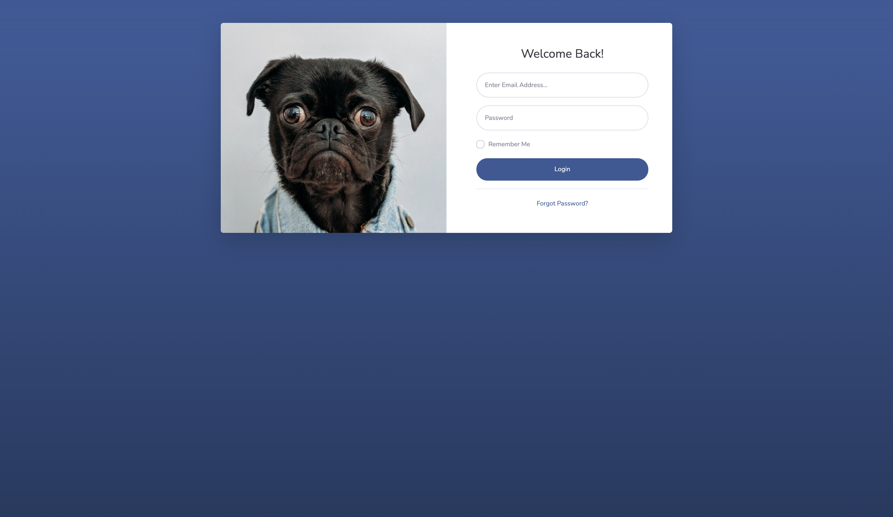
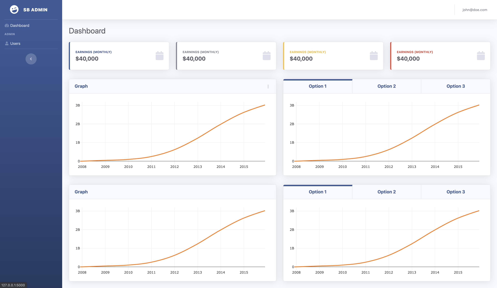
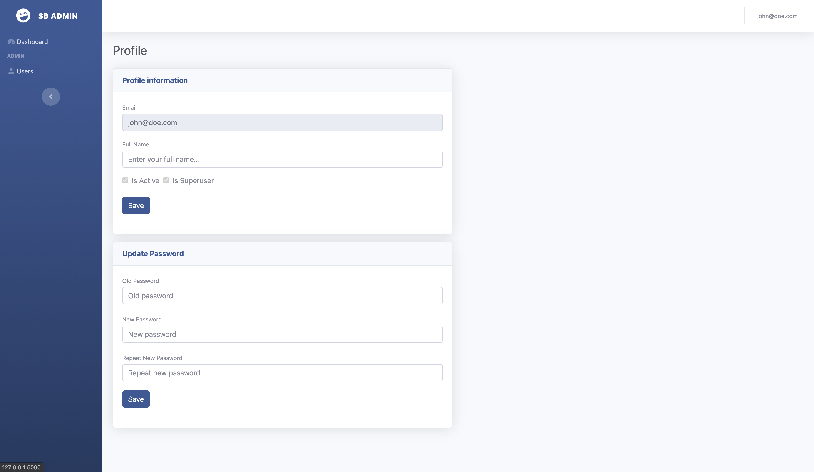
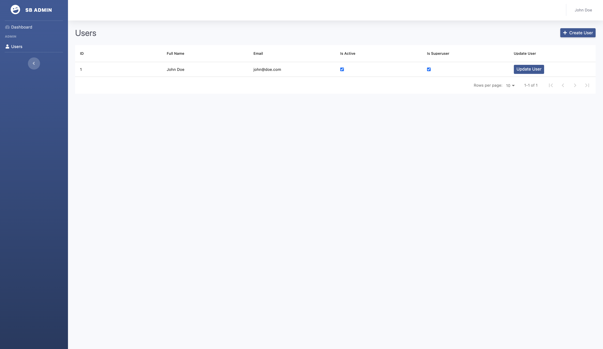

# cookiecutter-dash-full-stack

Create a dash app with user authentication.

## Login

## Dashboard

## Profile

## Users

# Get going

- `pip install cookiecutter`
- `cookiecutter https://github.com/elben10/cookiecutter-dash-full-stack`
- Follow the instructions in projects readme file

## Credits

- The theme is based upon [SB Admin 2 theme](https://startbootstrap.com/theme/sb-admin-2)
- The code is heavily based upon [tiangolos](https://github.com/tiangolo) [full stack project](https://github.com/tiangolo/full-stack-fastapi-postgresql)
